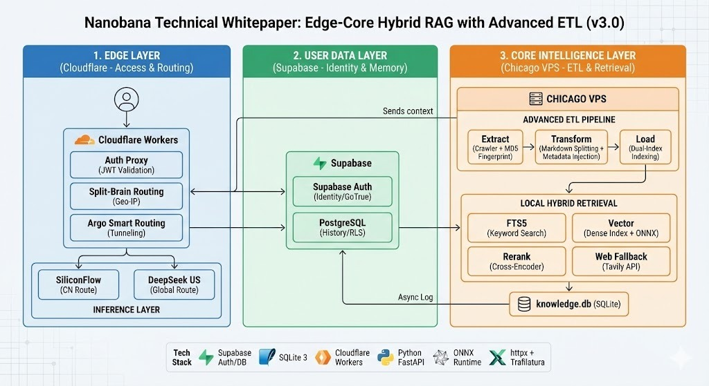

# IlliniGuide Monorepo

English | [中文](./README_CN.md)

---

## English Version

A three-layer UIUC knowledge platform split across the app, API gateway, and crawler/ETL pipeline.

## Monorepo Map

| Path | Role |
|:-----|:-----|
| `app/` | React app, Cloudflare Pages functions, docs, migrations, and active UI runtime. |
| `api/` | Cloudflare Worker gateway for JWT auth, geo routing, proxying, CORS, and health checks. |
| `data_collection/` | Python crawler/ETL pipeline for harvesting, cleaning, and incrementally updating UIUC sources. |

### 🚀 Main Application (`app/`)

The main application is a modern web app built with React 19, TypeScript, Vite, and Tailwind CSS. It uses Supabase for backend services and Cloudflare Pages for deployment and serverless functions.

#### Quick Start

To run the application locally:

1. **Navigate to the project directory:**

   ```bash
   cd app
   ```
2. **Install dependencies:**

   ```bash
   pnpm install
   ```
3. **Start the development server:**

   ```bash
   pnpm run dev
   ```

   The app should now be running at `http://localhost:5173`.

### 🏗️ Architecture & File Organization

**Architecture Diagram**



We follow a strict file structure to keep the codebase maintainable. All source code resides in the `src/` directory.

| Directory                    | Description                                                                    |
|:-----------------------------|:-------------------------------------------------------------------------------|
| `src/`                       | **Core Application Source Code**                                               |
| &nbsp;&nbsp;├─ `app/`        | Global app configuration and routes.                                           |
| &nbsp;&nbsp;├─ `components/` | Reusable React UI components (e.g.,`ChatScreen.tsx`, `Sidebar.tsx`).           |
| &nbsp;&nbsp;├─ `services/`   | API clients and business logic (e.g.,`conversationService.ts`, `supabase.ts`). |
| &nbsp;&nbsp;├─ `contexts/`   | Global React Context providers (e.g.,`AuthContext.tsx`, `ThemeContext.tsx`).   |
| &nbsp;&nbsp;├─ `pages/`      | Top-level page components (if applicable).                                     |
| &nbsp;&nbsp;├─ `hooks/`      | Custom React hooks.                                                            |
| &nbsp;&nbsp;├─ `utils/`      | Utility functions.                                                             |
| &nbsp;&nbsp;├─ `constants/`  | Constant values and configuration.                                             |
| &nbsp;&nbsp;├─ `i18n/`       | Internationalization resources.                                                |
| &nbsp;&nbsp;├─ `data/`       | Static data files.                                                             |
| &nbsp;&nbsp;└─ `types/`      | TypeScript type definitions and interfaces.                                    |
| `functions/`                 | Cloudflare Pages Functions (Serverless backend).                               |
| `tests/`                     | Automated tests (Python/JS).                                                   |
| `docs/`                      | Detailed project documentation.                                                |
| `scripts/`                   | Utility/Maintenance scripts.                                                   |

### 🛠️ Guide for Developers

#### Making Changes

- **UI/Components:** Look into `src/components/`. We use functional components and Tailwind CSS.
- **Business Logic:** API calls and core logic should be in `src/services/`.
- **Global State:** If you need to access Auth or User settings, check `src/contexts/`.

#### Rules & Best Practices

1. **Strict TypeScript:** Do not use `any`. Define interfaces for props and state.
2. **CSS:** Use Tailwind utility classes. Avoid inline styles.
3. **New Files:** Place new components in `src/components/` and services in `src/services/`.

For detailed file rules, refer to `app/docs/FILE_RULES.md` (if available) or strict adherence to the folders above.

### 📊 Data Collection (`data_collection/`)

Scripts for populating the knowledge base.

- `get_data.py`: Main script or entry point for data fetching.
- `clean_domians.py`: Utilities for cleaning and normalizing domain data.
- `*.json` / `*.txt`: Raw and processed data files.

### 📚 Documentation

Detailed documentation can be found in the `app/docs/` folder, including:

- `CHATFLOW_SETUP.md`: Guide for configuring the Coze/Chat workflow.
- `Setup Guides`: Detailed environment setup.

---

## Architecture Overview

### One-liner
A Cloudflare edge layer, Supabase user-data layer, and Chicago VPS intelligence layer work together as a low-latency RAG system for UIUC content.

### 3-Layer Split

#### Layer 1 — Edge Layer

- Cloudflare Workers handle the public entrypoint.
- The auth proxy verifies Supabase JWTs before proxying traffic.
- Geo-IP routing sends CN traffic to SiliconFlow and global traffic to DeepSeek US.
- Argo Tunnel keeps the Chicago VPS private and stabilizes edge-to-core requests.

#### Layer 2 — User Data Layer

- Supabase Auth handles sign-up, login, OAuth, and password recovery.
- PostgreSQL stores chat history.
- RLS keeps each user scoped to their own records.
- Async logging writes conversations after the main response path completes.

#### Layer 3 — Core Intelligence Layer

- A Chicago-based VPS runs the Python core services, ideally behind FastAPI.
- The core layer stays close to UIUC sources for low-latency crawling and local processing.

### Hybrid Retrieval Pipeline

#### Extract

- Fetch HTML with `httpx`.
- Hash content with MD5 and skip unchanged pages.
- Track document state in `knowledge.db`.

#### Transform

- Clean pages with Trafilatura.
- Split content by Markdown headers instead of raw character counts.
- Inject source metadata into each chunk to preserve course and page context.

#### Load

- Store the knowledge base in SQLite.
- Use FTS5 for exact keyword matches.
- Use sqlite-vec plus ONNX embeddings for semantic retrieval.

#### Query

- Run FTS5 and vector search in parallel.
- Rerank candidates with `bge-reranker-v2-m3`.
- Fall back to Tavily when the top score is too low.

### Why Chicago VPS Matters

- It is physically close to UIUC sources, so crawling is fast.
- CPU-heavy cleaning, chunking, and vectorization stay local instead of using expensive APIs.
- SQLite keeps retrieval and raw-text lookup in one process.

### Operational Simplicity

- `knowledge.db` stays easy to back up and move.
- FTS5 + vector search live beside the source text, so the system avoids extra infra.

### Tech Stack Summary

- **Supabase:** Auth, Postgres, and RLS.
- **Cloudflare Workers / Argo Tunnel:** Edge gateway, routing, and secure backhaul.
- **Python FastAPI:** Core backend services.
- **SQLite 3 + FTS5 + sqlite-vec:** Local knowledge store and retrieval indexes.
- **ONNX Runtime:** Local embedding and reranking inference.
- **httpx + Trafilatura:** Crawling and cleaning.
- **Tavily API:** Web fallback.
