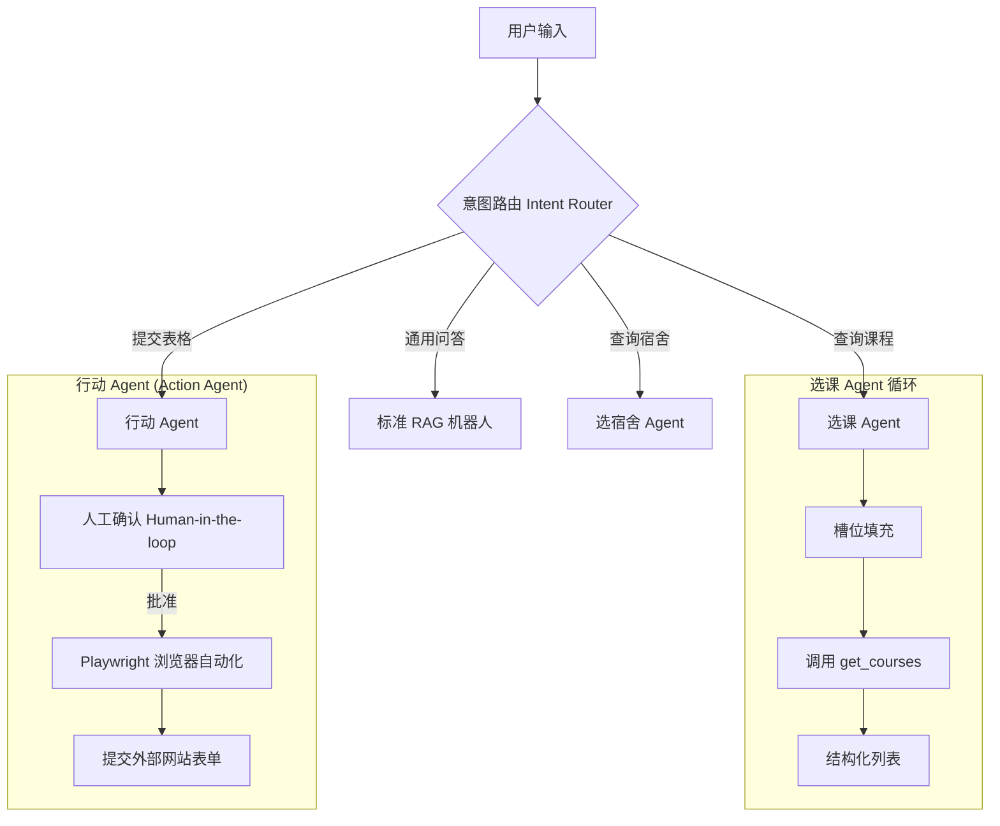

# AI Agent 架构设计: 选课与选宿舍 Agent

本文档概述了 **选课 Agent (Course Selection Agent)** 和 **选宿舍 Agent (Dorm Selection Agent)** 的技术设计。与使用非结构化 RAG 的通用问答机器人不同，这些 Agent 需要 **结构化数据 (Structured Data)**、**工具调用 (Function Calling/Tools)** 和 **多轮状态管理 (Multi-turn State Management)**。

## 1. 高层 Agent 流程 (High-Level Agentic Flow)



## 2. 选课 Agent (Course Selection Agent)

### 2.1 目标

帮助学生根据特定要求（通识教育类别 GenEd、学分、GPA、主题）查找课程，以优化他们的课程表。

### 2.2 数据 Schema (SQL)

我们需要在 `knowledge.db` (或 Supabase) 中建立一个结构化的 `courses` 表。

```sql
CREATE TABLE courses (
    crn TEXT PRIMARY KEY,
    subject TEXT,          -- 例如: "CS", "HIST"
    number TEXT,           -- 例如: "440", "101"
    name TEXT,             -- 例如: "Artificial Intelligence"
    description TEXT,      -- 全文描述
    credit_hours_min REAL,
    credit_hours_max REAL,
    avg_gpa REAL,          -- 来自 UIUC GPA 数据集
    gen_ed_categories TEXT,-- JSON 数组: ["Humanities", "Cultural Studies"]
    terms_offered TEXT     -- JSON 数组: ["Fall 2024", "Spring 2025"]
);

-- 搜索索引
CREATE INDEX idx_course_gpa ON courses(avg_gpa);
CREATE INDEX idx_course_gen_ed ON courses(gen_ed_categories);
```

### 2.3 工具定义 (Function Calling)

我们将向 LLM 提供以下工具定义。

```json
{
  "name": "search_courses",
  "description": "根据标准查询 UIUC 课程目录。",
  "parameters": {
    "type": "object",
    "properties": {
      "subject": {
        "type": "string",
        "description": "课程科目代码 (例如 CS, ECE)"
      },
      "min_gpa": { "type": "number", "description": "最低平均 GPA 要求" },
      "gen_ed": {
        "type": "string",
        "description": "通识教育类别 (例如 'Humanities', 'Quantitative Reasoning')"
      },
      "level_min": {
        "type": "integer",
        "description": "最低课程等级 (例如 400)"
      },
      "keywords": {
        "type": "string",
        "description": "主题关键词 (例如 'machine learning')"
      }
    }
  }
}
```

## 3. 选宿舍 Agent (Dorm Selection Agent)

### 3.1 目标

帮助学生根据生活方式偏好、预算和位置选择住房。

### 3.2 数据 Schema (SQL)

我们需要一个 `dorms` 表。

```sql
CREATE TABLE dorms (
    id TEXT PRIMARY KEY,   -- 例如: "isr-wardall"
    name TEXT,             -- 例如: "ISR (Illinois Street Residence)"
    location_zone TEXT,    -- "Urban-Champaign", "Green St", "Urbana-Residential"
    price_tier INTEGER,    -- 1 (经济型) 到 5 (豪华型)
    ac_available BOOLEAN,  -- 是否有空调
    dining_hall_nearby BOOLEAN, -- 附近是否有食堂
    vibe_tags TEXT,        -- JSON: ["social", "quiet", "engineering-heavy"] (氛围标签)
    room_types TEXT        -- JSON: ["single", "double", "suite"] (房型)
);
```

### 3.3 工具定义 (Tool Definition)

```json
{
  "name": "search_dorms",
  "description": "查找符合用户偏好的宿舍。",
  "parameters": {
    "type": "object",
    "properties": {
      "has_ac": { "type": "boolean", "description": "是否必须有空调" },
      "max_price_tier": {
        "type": "integer",
        "enum": [1, 2, 3, 4, 5],
        "description": "最高价格等级 (1-5)"
      },
      "location": {
        "type": "string",
        "description": "偏好区域 (例如 'near engineering quad')"
      },
      "vibe": {
        "type": "string",
        "description": "社交氛围 (例如 'quiet' 安静, 'social' 社交)"
      }
    }
  }
}
```

## 4. 行动 Agent (Action Agent) - 提交表格

### 4.1 目标

使 Agent 具备在外部网站上**填写并提交表格**的能力（例如：填写“联系我们”、提交住房意向、模拟选课）。

### 4.2 技术方案：浏览器自动化 (Browser Automation)

使用 **Playwright** (或 Puppeteer) 在安全沙箱中运行无头浏览器。

### 4.3 流程与安全 (Security Protocol)

1.  **数据收集**: Agent 通过多轮对话向用户收集所需信息。
2.  **人工确认 (Confirmation)**: **关键步骤！** Agent 必须向用户展示即将填写的 JSON 数据，并**获得用户明确点击“确认提交”**后，才启动 Playwright。
3.  **执行 (Execution)**: Playwright 脚本导航到目标 URL -> 寻找输入框 -> 填入数据 -> 点击提交。

### 4.4 工具定义 (Tool Definition)

```json
{
  "name": "submit_form_action",
  "description": "在外部网站上执行表单提交操作。",
  "parameters": {
    "type": "object",
    "required": ["target_url", "form_data"],
    "properties": {
      "target_url": { "type": "string", "description": "目标表单页面的 URL" },
      "form_data": {
        "type": "object",
        "description": "键值对，对应表单项 (例如: {'email': '...', 'message': '...'})"
      }
    }
  }
}
```

## 5. 实施策略 (Implementation Strategy)

### 第一阶段：数据采集 (Scrapers)

- **课程 (Courses)**: 爬取 `courses.illinois.edu` 并与 `waf.cs.illinois.edu/discovery/gpa/` (GPA 数据) 合并。
- **宿舍 (Dorms)**: 爬取 `housing.illinois.edu` + Reddit/Discord 评论以获取 "氛围 (vibe)" 标签。

### 第二阶段：后端 (Backend - Cloudflare/FastAPI)

- 使用 SQL 查询实现 `search_courses` 和 `search_dorms` API 端点。
- 实现 `ActionService`，用于调度 Docker 容器中的 Playwright 任务（注意：Cloudflare Workers 无法直接运行完整浏览器，可能需要外挂 VPS 服务）。

### 第三阶段：前端 (Frontend - UI)

- **结构化卡片 (Structured Cards)**: 不仅仅是显示文本，而是渲染 **"课程卡片 (Course Card)"**（带有颜色编码的 GPA 徽章）和 **"宿舍卡片 (Dorm Card)"**（带有照片/设施图标）。
- **确认弹窗 (Confirmation Modal)**: 专用于 Action Agent 的二次确认界面。
